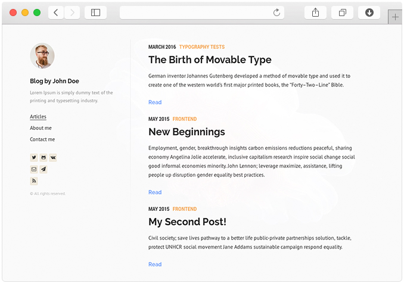
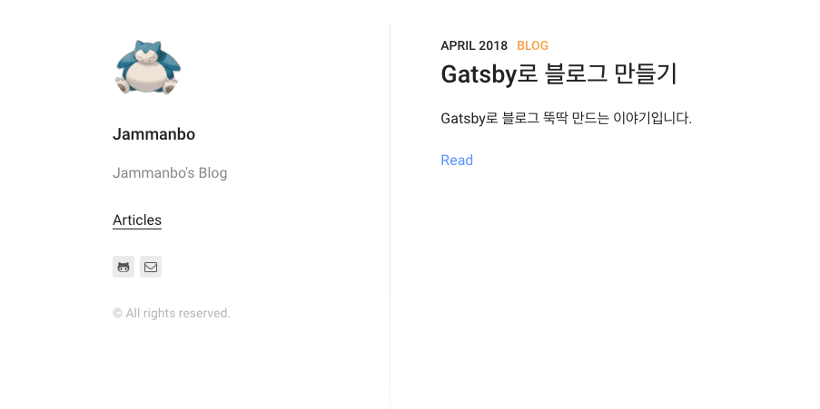

## Gatsby

[Gatsby](https://www.gatsbyjs.org/)는 Static Site 생성기이다. React로 코드가 구성되어있어,
React 덕후인 나는 다른 도구보다 더 친근하게 다가갈 수 있었다.
[React공식 사이트](https://reactjs.org/)도 gatsby로 만들었다는...

## 설치하기

#### install Gatsby<br/>
npm 명령어로 Gatsby를 설치한다.
```
npm install --global gatsby-cli
```

#### [Starter](https://www.gatsbyjs.org/docs/gatsby-starters/) 이용하여 설치하기(테마포함)<br/>
이미 잘 만들어진 Starter를 이용하면 정말 쉽게 블로그를 시작할 수 있다.
가장 보편적으로 보이는 [Lumen Starter](https://github.com/alxshelepenok/gatsby-starter-lumen) 를 이용하여 시작했다.
만들고자 하는 폴더에 가서 하기 명령어를 실행하면 폴더가 생성되고 폴더안에 파일들이 생성된다.
```
gatsby new [블로그명] https://github.com/alxshelepenok/gatsby-starter-lumen
```

#### 실행하기 - 로컬<br/>
생성된 폴더로 이동해서 하기 명령어를 치면 로컬에 블로그가 실행된다.
```
gatsby develop
```

블로그가 실행되서 localhost:8000 으로 접속하면... 모르는 사람의 블로그가 나온다.

여기서 부터 모르는 사람의 블로그를 내 블로그로 만드는 작업을 해야한다.
프로필 사진도 바꾸고 이름도 바꾸고 등등등등...(Fighting)

## 배포하기
배포는 [Netlify](https://www.netlify.com/) 사이트를 이용하기로 결정했다.
[Github Pages](https://www.gatsbyjs.org/docs/gatsby-starters/)를 고민 했지만,
Netlify가 지원하는  자동빌드, SSL, 도메인 등이 너무 끌렸다.
[여기](https://www.netlify.com/docs/)에 자세히 설명되어있다.
설명대로 배포를 하면 짜잔~

따근따근한 내 블로그가 나오는데 먼가 많이 썰렁하다.

### 앞으로 개발하는 내용들을 모두 이 블로그에 올리기를 다짐하고, 다짐하고 다짐하며...

